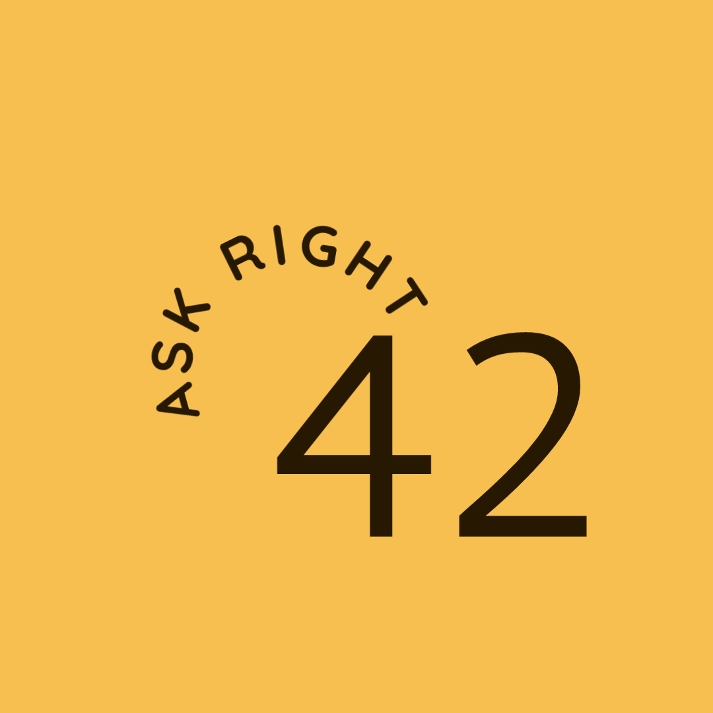

<p align="center">
  
</p>

<p align="center">
    
</p>


<br>

## ⚡ Techs

This project was developed using the following techs: 

- [React](https://reactjs.org)
- [Firebase](https://firebase.google.com/)
- [TypeScript](https://www.typescriptlang.org/)

## 🚀 How run it

Clone the project and goes to the directory.

```bash
$ git clone https://github.com/rocketseat-education/nlw-06-reactjs
$ cd nlw-06-reactjs
```

To run, follow this steps:
```bash
# Instalar as dependências
$ yarn

# Iniciar o projeto
$ yarn start
```
The app will be available in your browser at the address http://localhost:3000.


Remembering that you will need to create an account on the [Firebase](https://firebase.google.com/) and a project to provide a Realtime Database. 

## 💻 Projeto
42 - Ask right
It was created with he purpose of generating interactions with different people and generating new friendships.
The project has references to several themes that were part of my life, especially one of Douglas Adams' books.
So, as we know,  right question must be asked.


## 🔖 Layout
- [Vercel Deploy](https://42-eta.vercel.app/)
- [YouTube Video](https://www.youtube.com/watch?v=ZRiBYenFGCw) 


⚡ [LinkedIn](https://discord.gg/gKUVrzrPrU)